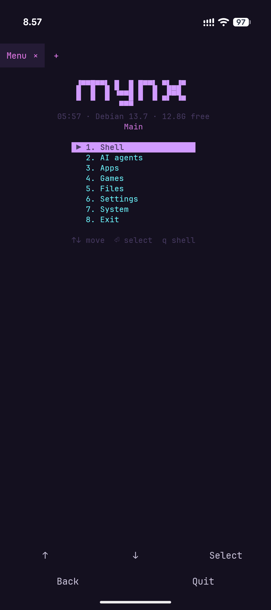
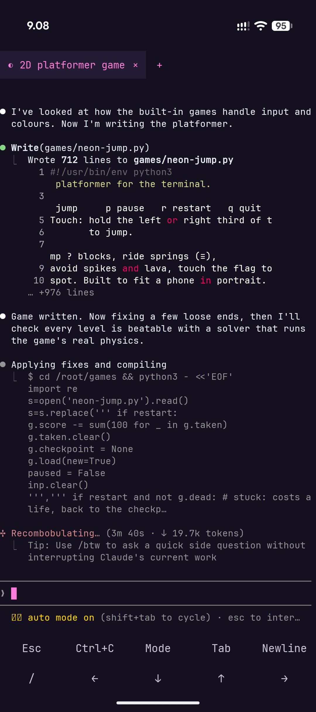
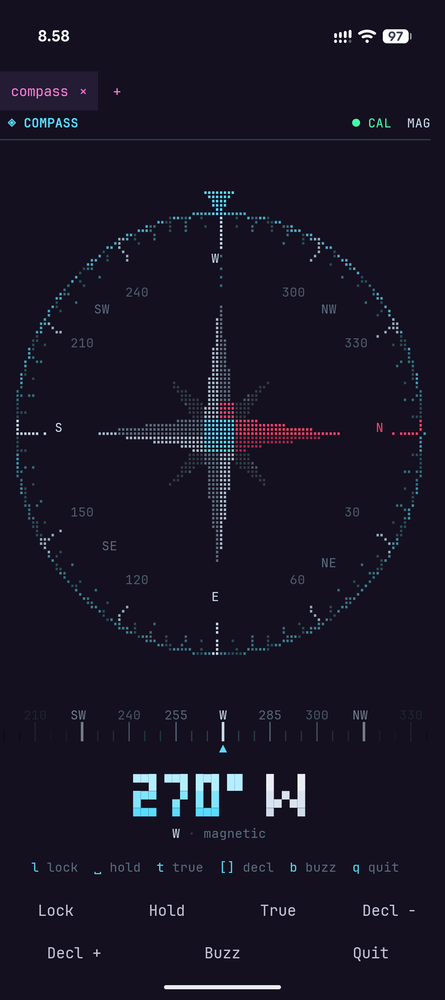
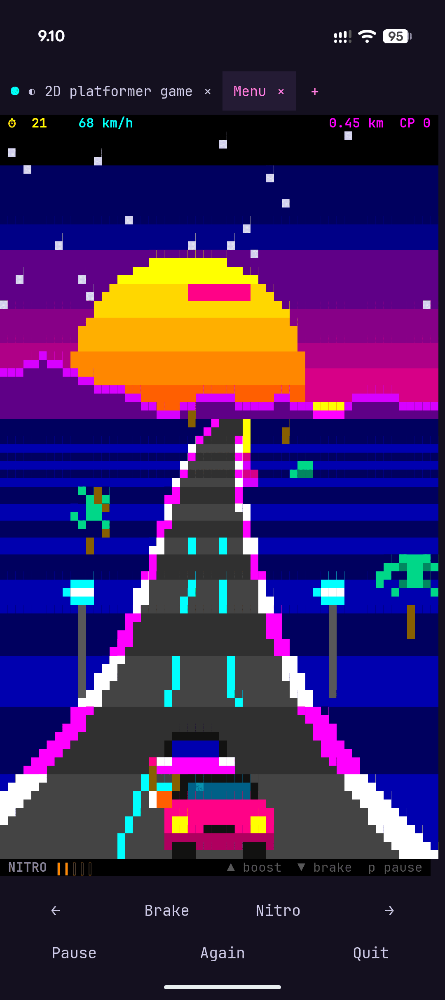
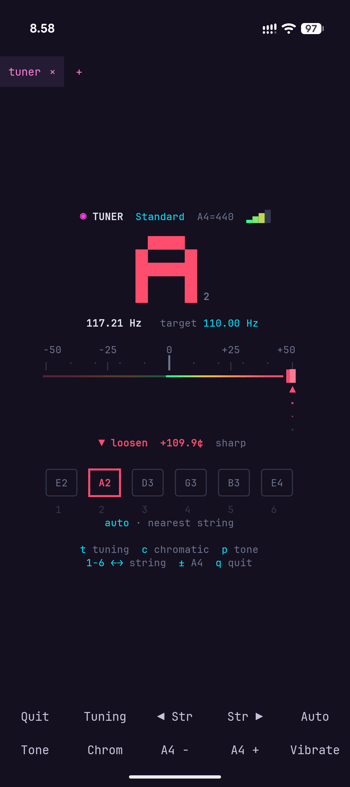
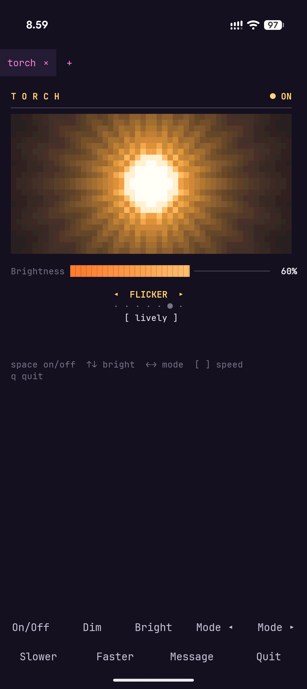
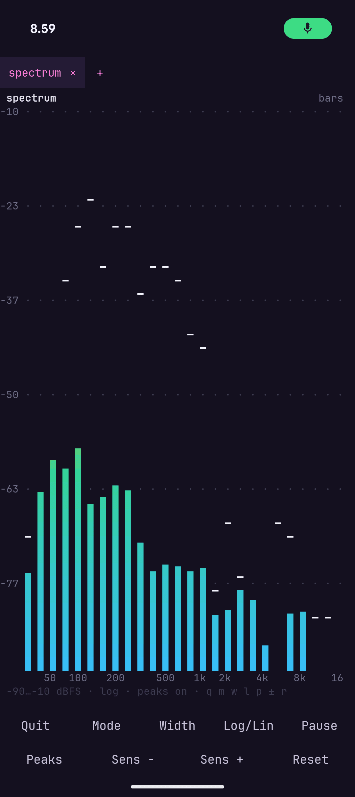
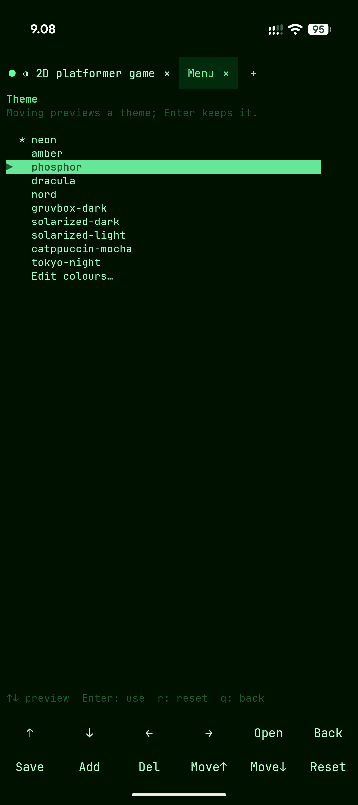

<h1 align="center"></h1>

**Your phone, your tools.** mynx is a new way to use a smartphone:
instead of searching an app store for something close enough and
putting up with its ads, tracking and subscriptions, you make the tool
you want, the way you want it. Describe it to an AI agent, or write it
yourself, and it runs right there on your phone, with its camera,
sensors, microphone, speaker and flashlight.

- **No ads, no tracking, no accounts.** mynx collects nothing
  ([`PRIVACY.md`](PRIVACY.md)), and it's free and open source.
- **Yours to change.** Every app it ships is a short program you can
  read and copy, and every setting is a text file. Change anything, or
  ask an agent to.
- **Debian Linux built in.** No root, no Termux, no setup scripts:
  install it, open it, and you're at a Debian shell.

> **Status:** in development, not released yet.

<table>
  <tr>
    <td align="center"> Menu</td>
    <td align="center"> AI agent</td>
    <td align="center"> Compass</td>
    <td align="center"> Drive</td>
  </tr>
  <tr>
    <td align="center"> Tuner</td>
    <td align="center"> Torch</td>
    <td align="center"> Spectrum</td>
    <td align="center"> Themes</td>
  </tr>
</table>

## What you get

- **Example apps to start from:** a compass, a spirit level, a
  flashlight, a sound spectrum, a sound meter, a guitar tuner and a
  metronome, each a short Python program that uses the phone. Run
  them, read them, or copy one into `~/apps` and make it your own: it
  shows up in the menu, and can have its own key bar.
- **Built for AI agents:** one-tap install of Claude Code, Codex or
  Gemini CLI (official installers, your own account), a guide in
  `~/AGENTS.md` so they can change your setup for you, and a phone
  notification when they finish or need you.
- **The phone from the shell:** notifications, clipboard, share,
  camera and flashlight, location, sensors, and sound, so Linux
  programs play through the speaker and record from the microphone.
- **Debian 13 (arm64).** `apt install` whatever you need; your files
  and packages survive app updates.
- **Tabs** that keep running in the background and come back when you
  reopen the app. Swipe sideways to switch.
- **A key bar** above the phone's keyboard (Esc, Tab, Ctrl, arrows, …)
  that changes with what's running: the file manager, games, AI agents
  and your own programs can each have their own.
- **A ready setup:** a launcher menu, a file manager
  ([nnn](https://github.com/jarun/nnn)), ten themes, a Nerd Font, the
  starship prompt and a few terminal games. Every setting is a text
  file in `~/.config/mynx/`, with an editor for each and undo.

## Install

Needs an **arm64** phone with **Android 8** or newer.

1. Download `mynx-X.Y.Z.apk` from [Releases](../../releases).
2. Open it. The first time, Android asks you to allow installing apps
   from your browser or Files app.
3. Open mynx. The first launch unpacks Debian, which takes a minute or
   two; after that it opens straight into the menu.

mynx checks for a new version once a day and tells you; `mynx update`
installs it, keeping Debian and your files.

## Getting started

- The **menu** opens first: apps, games, AI agents, settings. `menu`
  brings it back from the shell.
- **AI agents** in the menu installs and starts Claude Code, Codex or
  Gemini CLI; sign in with your own account. How well each works
  here:
  - **Claude Code:** works, tested.
  - **Codex:** works, tested, with its sandbox turned off. Its sandbox
    can't run under proot, so mynx asks to turn it off when it
    installs Codex.
  - **Gemini CLI:** not tested yet.
- `apt update`, then `apt install` any Debian package.
- `mynx edit` (the menu's Settings) changes the theme, font and key
  bars; `mynx help` lists everything the `mynx` command does.

## Good to know

- Debian runs through `proot`, not a virtual machine: no `systemd`,
  Docker or kernel modules, and heavy builds are slower than on a PC.
- Long jobs can pause while the screen is off. `mynx set wakelock on`
  keeps them going, at some cost in battery.

## Help and bug reports

`mynx report "what went wrong"` (or the menu's System → Report a bug)
shows a report with your phone's details, and sends it as a GitHub
issue only once you agree. You can also open an
[issue](../../issues) yourself.

`mynx github` (System → GitHub setup) installs `git` and `gh`, signs
you in to GitHub in the browser and sets git's name and email; then
bug reports go straight to GitHub.

## License

mynx is free software under the **MIT License**: see
[`LICENSE`](LICENSE). If you distribute a changed version, please give
it its own name and icon. The components it bundles keep their own
licences; `mynx about` lists them with their sources.

Want to help build it? See [`docs/ROADMAP.md`](docs/ROADMAP.md).
